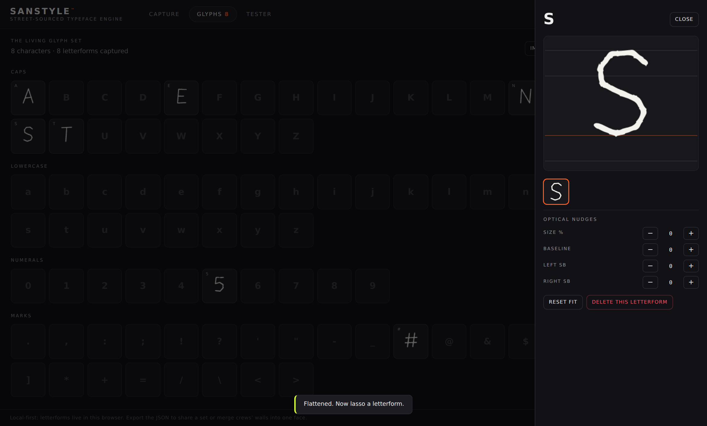

# SANSTYLE™

**Street-sourced typeface engine.** Photograph graffiti around town, lasso a
letterform, and it becomes a glyph in a living, typeable, downloadable font —
perspective-corrected, vectorized, optically fitted, and auto-spaced, all in
the browser.

Photo of a wall → usable `.ttf`, in about fifteen seconds per letter.


## Run it

It's a fully client-side static app — no build step, no dependencies, nothing
leaves your machine.

```bash
python3 -m http.server 8000     # or: npx serve .
# open http://localhost:8000
```

Opening `index.html` straight from disk works too. Host the folder anywhere
static (GitHub Pages included) and it's live.

No photo handy? **DEMO WALL** generates a sprayed letter on a brick wall so
you can try the whole flow immediately.

## The workflow

1. **WALL** — upload a phone shot (or drag & drop one onto the stage).
2. **FLATTEN** — drag four corners onto the wall plane; a homography warp
   removes the camera angle. Skip it for straight-on shots.
3. **LASSO** — draw a loose loop around *one* letterform.
4. **INK** — the app finds the paint inside the loop. `AUTO` uses Otsu
   thresholding on luminance; `PICK PAINT` matches the sprayed color you
   click (multiple clicks widen the range — handy for fades). De-noise,
   speck filter, and curve-fit sliders retune the trace live.
5. **TAG & ADD** — type which character it is, hit Enter. Done.

Each capture lands in the **GLYPHS** library (every slot keeps unlimited
variants — pick which one ships, nudge size/baseline/sidebearings if you
disagree with the auto fit). The **TESTER** types with the real compiled font
and the **DOWNLOAD** button hands you an installable TTF.


## The two bits of magic

**1 — Photo → clean vector.** The lassoed region is segmented (Otsu on
luminance, or perceptual color distance from your sampled paint), cleaned
with morphological close/open and a connected-component speck filter, then
boundary-traced. The 1-px staircase is relaxed, simplified (Ramer-Douglas-
Peucker), split at corners, and each smooth run is least-squares fit with
cubic Béziers (Schneider's algorithm). Counters survive as holes with correct
winding. Drips are yours to keep or de-noise away.

**2 — Any letterform → consistent typeface.** Every glyph is fitted into a
1000-UPM em by its character class (caps/figures to the 700-unit cap height,
x-height, ascender, and descender classes for lowercase, a tuned table for
marks). Then the optics:

- **Overshoot compensation** — the fitter measures how flat the outline is at
  its extremes. Flat tops (E, H, T) align exactly; round ones (O, S) get
  ~11 units of overshoot; pointed apexes (A, V) get ~15 — so everything
  *looks* the same height, which is the thing that actually matters.
- **Auto sidebearings** — a simplified HT-Letterspacer: the whitespace depth
  of each side's margin profile is averaged over the measuring band, and open
  profiles (A, L, T) get pulled tighter than solid stems (H, N). Proportional
  spacing with zero manual metrics.

The compiler then emits a complete TrueType font — cubic→quadratic conversion,
winding normalization, `glyf/loca/cmap/head/hhea/hmtx/maxp/name/post/OS-2`
with correct checksums — and hot-swaps it into the page via the FontFace API.
The tester isn't a canvas simulation; it's the actual font. ~7 ms per rebuild.



## Sharing sets

Everything is local-first (`localStorage`). **EXPORT JSON** writes the whole
library — outlines, variants, fit metadata — and **IMPORT / MERGE** unions
someone else's set into yours (variant IDs dedupe). That's the current answer
to "crowd-sourced": pass sets around, merge crews' walls into one face.

The storage layer is a single small module (`js/store.js`) with a JSON wire
format, deliberately shaped so a shared backend (tiny API + moderation queue)
can slot in behind it later without touching the capture or font code.

## Under the hood

```
js/
  geometry.js    vectors, RDP, point-in-poly, homography solve, Bézier math
  fitcurves.js   Schneider least-squares cubic fitting
  raster.js      luma/Otsu, color match, morphology, components, poly fill
  trace.js       mask → boundary loops → corner-aware Bézier contours
  fitting.js     char classes, overshoot, auto-spacing, glyph records
  ttf.js         dependency-free TrueType compiler
  store.js       library model + persistence + import/export
  demo.js        procedural demo walls (seeded)
  ui/            capture stage, glyph grid, live tester
```

Plain ES5-ish classic scripts, one global namespace (`ST`), zero runtime
dependencies. The same files run headless in Node for tests.

## Tests

```bash
npm test        # 18 unit tests: geometry, tracing, fitting, TTF byte format
npm run e2e     # headless Chromium: real-mouse lasso → submit → download,
                # validated by an independent TTF parser AND fontTools
python3 tools/validate_font.py some-font.ttf   # standalone font check
```

The e2e run drives the actual UI (pointer events on the canvas), compiles a
font from eight demo captures, downloads it, byte-compares the download to the
in-memory build, and round-trips it through fontTools. It also regenerates the
screenshots above.

## Roadmap

- **Live community wall** — a small sync server so anyone can contribute
  letterforms from anywhere and the face evolves in public. The store's JSON
  format is already the wire format; needs auth + a moderation queue.
- OpenType alternates (`rand`/`calt`) so repeated letters cycle through
  captured variants like a real hand would.
- Stroke-weight normalization across captures (currently: sizes are optical,
  weights are honest).
- Kern-pair suggestions for the worst offenders (AV, To, r.).
