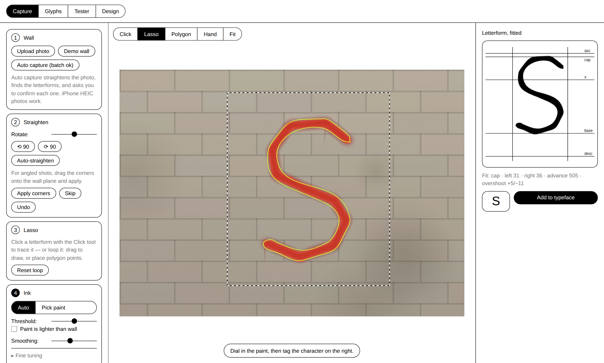
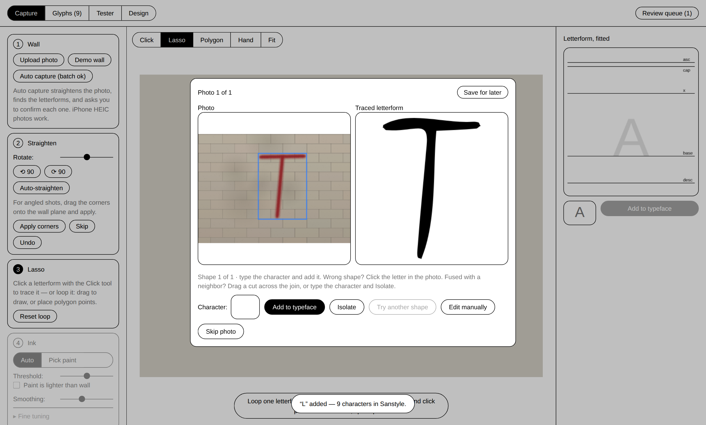
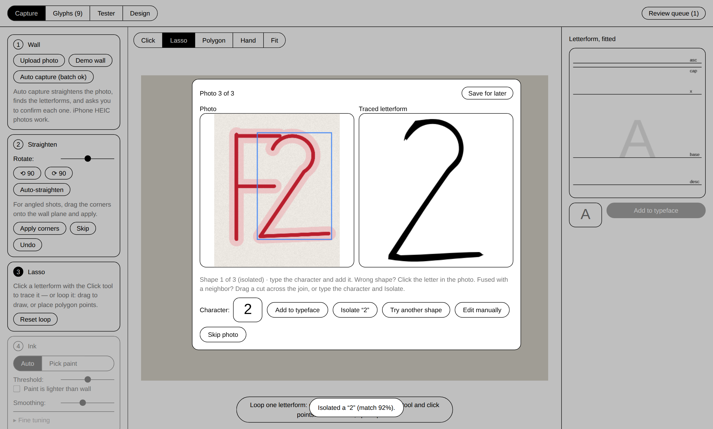
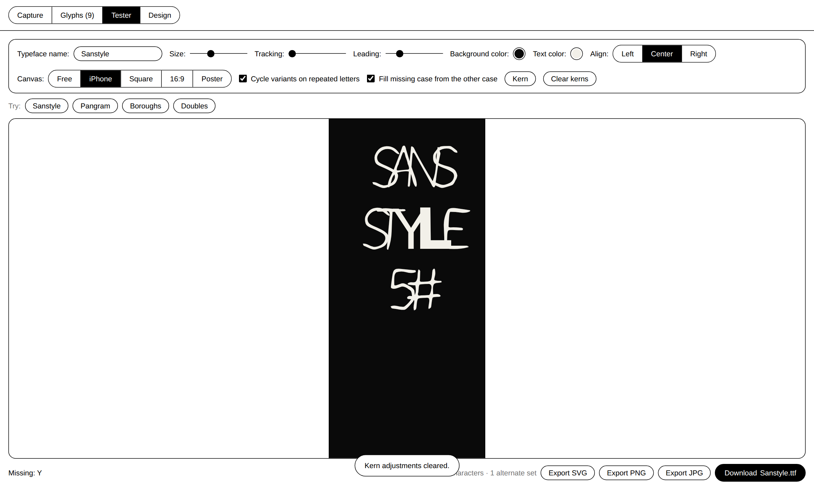

# Sanstyle

**Street-sourced typeface engine.** Photograph graffiti around town, lasso a
letterform (or let the machine find it), and it becomes a glyph in a living,
typeable, downloadable font — perspective-corrected, vectorized, optically
fitted, and auto-spaced, entirely in the browser.

Photo of a wall → usable `.ttf`.



## Run it

Fully client-side static app — no build step, no server, nothing leaves your
machine.

```bash
python3 -m http.server 8000     # or: npx serve .
# open http://localhost:8000
```

Opening `index.html` from disk works too. **Demo wall** generates a sprayed
letter so the whole flow can be tried without a photo. iPhone **HEIC/HEIF**
photos upload directly (Safari decodes natively; elsewhere a vendored libheif
decodes locally).

## Two ways in

**Manual (full control).** Upload → optionally drag four corners onto the
wall plane (homography flatten) → loop the letterform with the freehand
**Lasso** or click-point **Polygon** tool → dial in the ink → tag → add.

Ink controls: automatic Otsu thresholding or **Pick paint** color matching
(multiple clicks widen the range), de-noise, speck filter, curve fit, and:

- **Fill gaps** — heals spray-coverage holes inside the ink. Low values close
  pinholes while counters survive; cranked, the letter goes fully solid.
- **Block out overlap** — when another letter crosses the one you want,
  brush over the intruder. Its paint is removed and your stroke is bridged
  back through the blocked zone with a morphological inference of where the
  hidden edge continues. Brush size and bridge reach are adjustable.

**Auto capture (single or batch).** Select one or many photos: each is
auto-straightened (gradient-orientation deskew) and its paint is separated
from the wall or paper by color contrast against the background — the paper
is the frame's dominant color, paint is whatever contrasts most with it, and
the threshold sits where the boundary is sharpest, never past the midpoint
between the two. That keeps marker strokes stroke-thin on fibrous paper
instead of swallowing the pink bleed halo around them. Everything lands in a
review queue — the photo with the shape boxed, the traced letterform beside
it — where you type the character and **Add**, **Skip**, or **Edit manually**
(drops that photo into the manual studio, pre-lassoed). A photo leaves the
queue only when its letterform was added or skipped.



**Click the letter you see.** If the detected shape isn't the one you want,
click the letter in the photo: the click snaps to the densest paint nearby
(a click in the halo or just off a thin stroke still seeds from the stroke),
the paint color is sampled and refined, and the connected stroke region is
grown at the tolerance whose edge is sharpest. Fused with a neighbor? Drag a
short cut across the join and the region regrows without it — or type the
character and **Isolate**: a stroke-weight-agnostic template search (two-way
chamfer match against system-font renders, scored on the ink connected to
your click) finds where that character sits inside the fused shape, keeps
what's inside, gives back any of the letter's own overhang the box clipped,
and follows each neighbor stroke that enters the box to where it joins the
letter, cutting it off there.



## The optical fitting

Every glyph is fitted into a 1000-UPM em by its character class (caps and
figures to the 700-unit cap height; x-height, ascender and descender classes
for lowercase; a tuned table for marks), then corrected:

- **Overshoot compensation** — flat extremes (E, H, T) align exactly; round
  ones (O, S) overshoot ~11 units; pointed apexes (A, V) ~15, so everything
  *looks* the same height.
- **Auto sidebearings** — the whitespace depth of each side's margin profile
  sets the bearing (a simplified HT-Letterspacer): open shapes tuck in,
  solid stems get full clearance. Proportional spacing with zero manual
  metrics.

The compiler emits a complete TrueType font (cubic→quadratic, winding
normalization, all ten required tables, correct checksums) and hot-swaps it
into the page via the FontFace API in a few milliseconds.

## The tester



- Types with the real compiled font. Newlines, paste, the lot.
- **Variant cycling** — when a character has several captured letterforms,
  repeated letters rotate through them (alternate fonts are compiled per
  variant slot), so doubles never twin. Toggleable.
- **Manual kerning** — hit **Kern**, click a letterform, and arrow-key it
  (shift for coarse). Esc returns to typing; kern tweaks carry into exports.
- Background color, text color, and alignment controls; tracking down to
  −0.25 em; canvas aspect presets (Free / iPhone / Square / 16:9 / Poster)
  for mockups.
- **Exports**: the specimen as **SVG** (true vector paths), **PNG**, or
  **JPG** — plus the installable **TTF** itself.

## Cloud sync (Google Drive + Vercel)

With the one-time setup in [SETUP-SYNC.md](SETUP-SYNC.md), the deployed site
becomes a passcode-gated, cross-device studio backed by two Drive folders:

- an **inbox folder** — share photos into it from your phone's Drive app (or
  upload through the site) and the site offers to extract letterforms from
  whatever is new since your last visit;
- a **letterforms folder** — `library.json` (the full library: variants,
  fits, nudges, settings) plus an auto-maintained **SVG mirror** of every
  letterform, ready to open in Illustrator.

The browser only ever talks to the site's own `/api` routes (Vercel
serverless, in `api/`), which hold the Drive credentials server-side and
check the passcode on every request. Without the env vars, the site runs
local-only exactly as before.

## Glyphs, sharing, design

The **Glyphs** tab holds the full character grid: per-slot variants,
activation, optical nudges (size, baseline, sidebearings), delete. The
library persists locally and round-trips through **Export / Import JSON** so
sets can be shared and merged. The **Design** tab live-adjusts the interface
itself — text size, padding, gaps, control height, corner radius, line
weight, canvas padding — persisted per browser.

## Under the hood

```
api/
  _lib.js        service-account JWT + Drive REST helpers (no SDK)
  health/library/inbox/photo/upload — the sync endpoints
js/
  geometry.js    vectors, RDP, point-in-poly, homography, Bézier math
  fitcurves.js   Schneider least-squares cubic fitting
  raster.js      Otsu, color match, morphology, components, fill-holes,
                 occlusion bridge
  trace.js       mask → boundary loops → corner-aware Bézier contours
  fitting.js     char classes, overshoot, auto-spacing, variant sets
  ttf.js         dependency-free TrueType compiler
  classify.js    template character classifier (local, human-confirmed)
  auto.js        deskew + letter detection for the automated lane
  heic.js        HEIC/HEIF intake (vendored libheif, lazy-loaded)
  export.js      specimen layout → SVG / PNG / JPG, per-letterform SVGs
  store.js       library model, persistence, import/export
  sync.js        passcode gate, Drive pull/merge/push, inbox prompts
  demo.js        procedural demo walls (seeded)
  ui/            capture stage, glyph grid, tester, review queue
```

Zero runtime dependencies (the HEIC decoder is vendored and loads only when
a HEIC arrives). The same files run headless in Node for tests.

## Tests

```bash
npm test        # 30 unit tests: geometry, tracing, fitting, morphology,
                # deskew, classifier scoring, TTF byte format, and the api
                # routes (JWT signing verified against a real keypair,
                # Drive calls stubbed)
npm run e2e     # headless Chromium: freehand + polygon lasso, flatten,
                # pick-paint, fill-gaps, HEIC intake, auto capture + review,
                # variant cycling, kerning, exports, TTF download — plus the
                # full sync flow (gate, inbox extraction, SVG mirroring,
                # wiped-device restore, site→Drive upload) against an
                # in-memory mock of the api contract
```

## Roadmap

- Live community wall (shared backend + moderation; the JSON export is
  already the wire format).
- OpenType `calt`/`rand` so variant cycling ships inside the font file, not
  just the tester.
- Stroke-weight normalization across captures.
