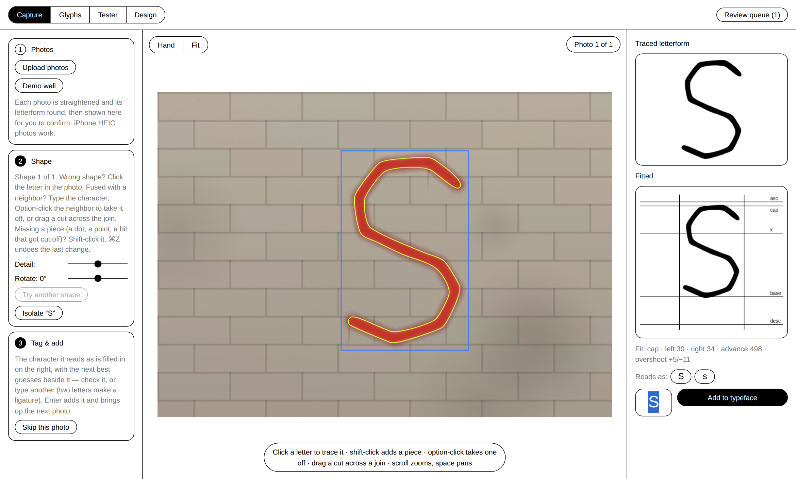
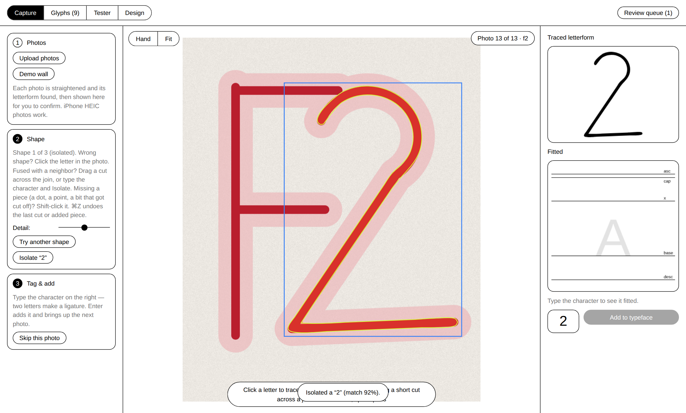
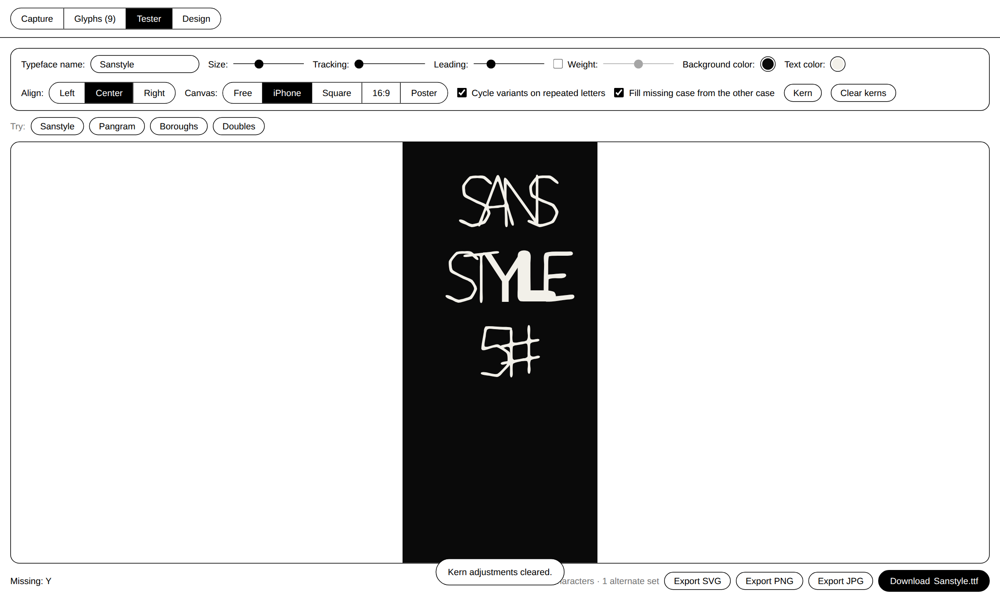

# Sanstyle

**Street-sourced typeface engine.** Photograph graffiti around town, drop
the photos in, confirm each letterform the machine finds, and it becomes a
glyph in a living, typeable, downloadable font — straightened, vectorized,
optically fitted, and auto-spaced, entirely in the browser.

Photo of a wall → usable `.ttf`.



## Run it

Fully client-side static app — no build step, no server, nothing leaves your
machine.

```bash
python3 -m http.server 8000     # or: npx serve .
# open http://localhost:8000
```

Opening `index.html` from disk works too. **Demo wall** generates a sprayed
letter so the whole flow can be tried without a photo. iPhone **HEIC/HEIF**
photos upload directly (Safari decodes natively; elsewhere a vendored libheif
decodes locally).

## How a letter gets in

Drop photos on the Capture tab (one or a hundred; iPhone HEIC works), share
them into the Drive inbox from your phone, or pick any photo from the Drive
gallery in the Glyphs tab. Each photo is analyzed in a background worker —
the page stays responsive while a stack of photos or a Drive re-scan is
worked through — and lands on the stage in turn: the paint is separated from the wall or paper by color contrast
against the background — the wall is the frame's dominant color, paint is
whatever contrasts most with it, and the threshold sits where the boundary
is sharpest, never past the midpoint between the two. That keeps marker
strokes stroke-thin on fibrous paper instead of swallowing the pink bleed
halo around them. The classifier works along the wall→paint color axis, so
metallic and glossy paint whose highlights and shading run *past* the paint
color (silver on dark red, chrome on brick) still reads as one shape, and
compact patches inside the paint that are neither paint nor wall — pocks,
cracks, dirt in a porous wall — are read as paint under it, not as holes.
Streaky strokes are jumped across at up to half a stroke width. The photo is
then straightened by the paint's own edges (its stems set upright, not the
wall's bricks or the paper's edge), and its resolution is normalized: a
letter shot from across the street is brought up to the same pixel height as
one shot up close before smoothing, so both get the same treatment.

**Which letter, and what it says.** A photo of graffiti is rarely one clean
letter: the letter you shot touches its neighbors, a sticker, a sign, drips
and flakes of paint. Every shape found is read by a small neural network
that runs in the browser (`js/recognize.js`, weights in
`js/letters-model.js`): it was trained on ~800,000 handwritten characters and
glyphs from ~700 fonts (hand-lettering, marker and display faces among
them), all distorted to look like extracted graffiti — stroke weight, slant,
wobble, drips, ragged edges, specks — and on "junk": two or three letters
fused, a letter with a neighbor's fragment or a cut-off neighbor on it,
debris, scribbles, blobs, stickers. So it says both which character a shape
is (A–Z, a–z, 0–9, `! ? # @ & $ % * + = / \ < > ( ) [ ]`) and whether it is
one character at all. The letter finder (`js/letters.js`) then takes each
shape apart stroke by stroke (skeleton pieces that stop wherever they meet
another) and grows groupings of them, keeping the ones that read most
clearly as a single character; a piece that continues one of a letter's
strokes straight through a crossing, or an arm or flourish that hangs on
one letter only, stays with that letter. Every letter found is ranked — it
reads clearly as one character, it is big, it sits near the middle of the
photo, the frame didn't cut it off — and the best comes first: in a photo
of "ck" the **k** comes up alone, the c, the stickers and the paint flakes
left behind, with **k** already typed in the character box and the next
best readings (**h**, **K**) one click away. A word gives one shape per
letter ("Try another shape"); the whole fused shape stays on offer behind
them. When nothing in the paint that stands out most reads clearly as a
letter (a sign, a sticker or a strip outshouting the tag), or a second
color covers a good part of the wall too, the wall's next paint color is
read as well, apart from the first — unless it only hugs the first paint
(a bleed halo, an outline, a 3D shadow: those belong to the same letters).

**Upright.** A leaning letter is stood up by its stems — a stroke followed
from end to end through its crossings, tall and near upright (a k's stem
counts even where it bends at the joint of its arm and leg). Stems that
disagree (an A's legs) or none at all (an O, an S) leave the letter as it
is. The glyph is built from the upright shape; the **Rotate** slider in the
Shape panel adjusts it, and a rotation set by hand is kept for the rest of
that photo.

On the stage the detected shape is boxed and its trace drawn over the paint;
the clean silhouette and the letterform fitted into the em sit beside it,
upright. A **Detail** knob re-reads the photo (low heals gaps and smooths
hard, high keeps every nuance). Check the character (or type another),
**Add** — the next photo comes up. A photo leaves the queue only when its
letterform was added or skipped, and the queue waits across tabs and
reloads of Drive photos. The same photo shared into the inbox twice (same
name, same size) is offered once.

**Click the letter you see.** If the detected shape isn't the one you want,
click the letter in the photo: the click snaps to the densest paint nearby
(a click in the halo or just off a thin stroke still seeds from the stroke),
the paint color is sampled and refined, and the connected stroke region is
grown at the tolerance whose edge is sharpest. Fused with a neighbor of the
same paint (touching it, crossing it, running into it), the letter finder
hands back the letter under the click alone — offered first when the whole
shape reads as several letters, the whole one step behind. Still fused?
**Type the character**: the shape is trimmed to it by itself when the trim matches the
character clearly better than the whole did (⌘Z brings the whole back).
Three readings compete, judged by the recognizer: the letter finder's
strokes grouped as that character, the shape grown stroke by stroke from
the one you clicked (strokes rejoined through junctions by good
continuation, so a bar that crosses a neighbor's O stays one bar and the O
stays one ring), and a template search. When they read about as well,
whole strokes win — they end the way the paint does, where a template's
box can slice a stroke on a slant and leave a point. Or **Option-click** the neighbor: the stroke under the
click goes, with whatever hangs on the letter only through it (a fused
neighbor, a drip, a stray blob), and the faces where it came off are healed
and capped. Or drag a short cut across the join and the region regrows
without it: the cut takes only from the far side of its line, so the letter
keeps every pixel up to the line — a cut drawn along or into the letter's
own stroke leaves no notch in it — or press **Isolate** to force the trim: a stroke-weight-agnostic template search (two-way
chamfer match against system-font renders, scored on the ink connected to
your click) finds where that character sits inside the fused shape. The
shape is then read as strokes — skeletonized, cut into pieces at junctions
and at sharp corners — and every stroke that leaves that box by more than a
couple of stroke widths is a neighbor's: it is dropped at its join, whether
it meets the letter side-on or continues one of its strokes around a
corner, and the cut face is healed and capped. The letter's own overhang
past an imperfect box stays.

Stroke ends get a marker's round cap: nothing a pen draws is sharper than
its tip, so needle points thinner than the thin side of the tip (measured
from the distance transform of the shape) are pruned back to a cap. Where a
stroke fades out — spray thinning, a marker lifting — the shape tapers to a
point the pen never made: the skeleton is walked in from each free end to
where the stroke has most of its width back, the taper beyond is dropped,
and the stroke ends there with a disc of that width. Anything *wider* than
the stroke near its end (an arrowhead) is drawn that way and kept. Where a
cut sliced a stroke flat, the sliced face is capped the same way. The
clean-up that shaves fibers, burrs and drips never takes what holds the
letter together: a thin neck where an arm meets its stem, or a worn,
speckled stretch of a curl — even one thin in several places in a row —
stays (a hair-thin strand of wall texture joins nothing). The tracer then
measures its corners and smoothing against the stroke width, so a round cap
only half a stroke across is fitted as a curve, never sharpened into a
corner; only inside corners, where two strokes meet, are put back on their
point — an outside corner is a stroke's end or the rim of a bend, and
extending its edges would grow a spike the wall never had.

**Seeing past what hides the letter.** A stroke that stops at bare wall has
ended: the pen lifted there. A stroke that stops at something else — a
drainpipe or a sign in front of it, a crack, a sticker, another color
painted over it, the edge of the photo — has only been hidden, and the
letter goes on underneath. Every pixel is read as wall, this paint, the
paint's own halo and shading, or hidden (anything else, and everything past
the frame, including the corners a straightened photo fills in). A stroke
end is cut short when the wall starts much further ahead of it than beside
it (a halo surrounds a stroke on every side alike; an occluder only sits in
front), and then:

- two cut-short ends that face each other across hidden ground are the same
  stroke, joined by the curve that continues both at their width — straight
  across a pipe, a circular arc round a U's bottom or an O's side past the
  frame — and never across visible wall; the pieces beyond join the letter;
- an end with no partner runs on into another piece of the letter if one
  lies straight ahead under the hidden ground (an N's stem hidden all the
  way down to its corner), or else carries on a plausible way — past the
  frame as far as the letter's other strokes reach that way, behind an
  occluder part way across it — and gets the pen's round cap;
- a stroke bitten along its side (a sticker over its edge, another color
  along it) gets its width back, measured from the edge that shows, onto
  hidden ground only;
- holes that show no wall (a sticker on the stroke, a chip) are filled, and
  a throw-up's outline — a band of another color hugging the whole letter —
  is part of it, counters and all.

A cut you draw is the one thing nothing is carried across.



**Ligatures and two-part characters.** Type two to four letters ("ar",
"bl", "gr") for a connected pair and it is captured as a ligature: the font
swaps it in whenever that sequence is typed (a GSUB `liga`/`rlig` lookup,
so it also fires in Illustrator, Figma, and browsers with tracking applied).
A character in pieces — the stem and point of a "!", an "i" and its dot —
is assembled by **shift-clicking** the other piece: only the new ink under
that click joins the shape, so a neighbor it touches stays out. The same
shift-click puts back a bit that the extraction, a cut or Isolate left out
(where no paint reads under the click at all — a glint, a worn patch — it
brushes in a stroke-width spot), and the pieces are remembered when the
shape is rebuilt by the Detail knob, a cut, an undo or an Isolate.
**⌘Z / Ctrl-Z** undoes the most recent cut, added or removed piece, or trim;
every one of them is remembered and replayed when the shape is rebuilt.

## The optical fitting

Every glyph is fitted into a 1000-UPM em by its character class (caps and
figures to the 700-unit cap height; x-height, ascender and descender classes
for lowercase; a tuned table for marks), then corrected:

- **Overshoot compensation** — flat extremes (E, H, T) align exactly; round
  ones (O, S) overshoot ~11 units; pointed apexes (A, V) ~15, so everything
  *looks* the same height.
- **Auto sidebearings** — the whitespace depth of each side's margin profile
  sets the bearing (a simplified HT-Letterspacer): open shapes tuck in,
  solid stems get full clearance. Proportional spacing with zero manual
  metrics.

The compiler emits a complete TrueType font (cubic→quadratic, winding
normalization, all ten required tables, a GSUB ligature lookup when the
library has ligatures, correct checksums) and hot-swaps it into the page via
the FontFace API in a few milliseconds.

## The tester



- Types with the real compiled font. Newlines, paste, the lot.
- **Variant cycling** — when a character has several captured letterforms,
  repeated letters rotate through them (alternate fonts are compiled per
  variant slot), so doubles never twin. Toggleable.
- **Weight slider** — runs from the library's lightest captured letterform
  to its heaviest; every letter shows the variant nearest that weight, so
  the whole line thickens as you slide (letters with one variant keep it).
- **Where did that come from?** Hover any letterform and the bit of photo it
  was cut from pops up (stored on this device, beside the library).
- **Manual kerning** — hit **Kern**, click a letterform, and arrow-key it
  (shift for coarse). Esc returns to typing; kern tweaks carry into exports.
- Captured ligatures shape as one glyph while you type, in the tester and in
  every export.
- Background color, text color, and alignment controls; tracking down to
  −0.25 em; canvas aspect presets (Free / iPhone / Square / 16:9 / Poster)
  for mockups.
- **Exports**: the specimen as **SVG** (true vector paths), **PNG**, or
  **JPG** — plus the installable **TTF** itself.

## Getting the best results

- **Shoot the whole letter with some wall around it.** The wall's color is
  read from the photo's border; a letter that fills the frame edge to edge
  is finished past the edge, but only as well as the rest of it suggests.
- **Straight on beats the perfect angle.** Up to ±20° of roll is straightened
  automatically; strong perspective (shooting a wall from the side) is not.
- **Full-resolution photos.** Share the originals into the Drive inbox (the
  Drive app keeps them; messaging apps shrink them). Letters are brought to
  the same working size either way, but a sharper original means cleaner
  edges.
- **Avoid hard shadows and glare across the letter.** A shadow reads as a
  different color and gets treated as something hiding the stroke.
- **Center the letter you want.** The letter nearest the middle of the
  frame, whole and big, is offered first; its neighbors come after it.
- **Sync as yourself.** Use the sign-in setup in [SETUP-SYNC.md](SETUP-SYNC.md)
  (an OAuth refresh token) rather than a service account, unless both
  folders live in a Shared Drive — otherwise Google refuses the writes.

The extraction is measured against synthetic walls with known ground truth
(`node tools/bench/run.mjs <tag>`: a drainpipe, a crack, stickers, an
overpainted letter, frame cutoffs, drips, a chrome throw-up, silver on
white, sharp valleys, fused same-color letters, fading marker ends), writing
an overlay per scene to `tools/bench/out/`, and against the photos in the
Drive inbox, each labeled with the character it shows.

The recognizer is rebuilt with `tools/recognizer/` (Python, PyTorch on the
CPU): `getfonts.py` and `fontcheck.py` fetch the fonts and check what each
covers, `gen.py` renders the distorted training set (EMNIST by-class from
Hugging Face + the fonts + junk), `train.py` trains the network and writes
`js/letters-model.js` (int8 weights, ~380 KB).

## Cloud sync (Google Drive + Vercel)

With the one-time setup in [SETUP-SYNC.md](SETUP-SYNC.md), the deployed site
becomes a passcode-gated, cross-device studio backed by two Drive folders:

- an **inbox folder** — share photos into it from your phone's Drive app (or
  upload through the site) and the site offers to extract letterforms from
  whatever is new since your last visit. The Glyphs tab shows every photo in
  the folder, used ones grayed; click any to extract from it again, or
  **Re-scan Drive photos** to queue them all;
- a **letterforms folder** — `library.json` (the full library: variants,
  fits, nudges, settings) plus an auto-maintained **SVG mirror** of every
  letterform, ready to open in Illustrator.

The browser only ever talks to the site's own `/api` routes (Vercel
serverless, in `api/`), which hold the Google credentials server-side and
check the passcode on every request. The site can act as your own Google
account (an OAuth refresh token, works with a personal Gmail) or as a
service account on a Shared Drive — Google no longer lets a service account
own files in a personal My Drive, and the red sync pill says so, with the
fix, when that is what's wrong. Without the env vars, the site runs
local-only exactly as before.

## Glyphs, sharing, design

The **Glyphs** tab holds the full character grid (plus a Ligatures row once
you have captured any): per-slot variants, activation, optical nudges (size,
baseline, sidebearings), delete. The
library persists locally and round-trips through **Export / Import JSON** so
sets can be shared and merged. The **Design** tab live-adjusts the interface
itself — text size, padding, gaps, control height, corner radius, line
weight, canvas padding — persisted per browser.

## Under the hood

```
api/
  _lib.js        Google auth (your account via OAuth, or a service-account
                 JWT) + Drive REST helpers (no SDK)
  health/library/inbox/photo/upload/diag — the sync endpoints
tools/
  get_refresh_token.mjs   one-time Google sign-in for the site
  validate_font.py        fontTools round-trip used by the tests
  bench/                  extraction bench: synthetic walls with ground truth
  recognizer/             training data + training for the letter recognizer
js/
  geometry.js    vectors, RDP, point-in-poly, homography, Bézier math
  fitcurves.js   Schneider least-squares cubic fitting
  raster.js      Otsu, color match, morphology, components, fill-holes,
                 occlusion bridge
  trace.js       mask → boundary loops → corner-aware Bézier contours
  fitting.js     char classes, overshoot, auto-spacing, variant sets,
                 ligature keys, weight targeting
  ttf.js         dependency-free TrueType compiler (+ GSUB ligatures)
  classify.js    template character matching (Isolate, trim on typing)
  recognize.js   the letter recognizer: a small conv net, run in plain JS
  letters-model.js  its trained weights (generated by tools/recognizer)
  letters.js     letters in a fused shape, stroke by stroke; upright lean
  auto.js        deskew + letter detection for the automated lane
  worker.js      runs the automated lane off the page's thread
  extract.js     click-to-trace, clean-up, stroke graph, stroke chains
  complete.js    occlusion: hidden stroke ends, joins, frame completion,
                 bitten strokes, outlines
  heic.js        HEIC/HEIF intake (vendored libheif, lazy-loaded)
  export.js      specimen layout → SVG / PNG / JPG, per-letterform SVGs
  store.js       library model, persistence, import/export
  sync.js        passcode gate, Drive pull/merge/push, inbox prompts
  demo.js        procedural demo walls (seeded)
  ui/            capture stage (the review surface), review queue, glyph
                 grid + Drive gallery, tester
```

Zero runtime dependencies (the HEIC decoder is vendored and loads only when
a HEIC arrives). The same files run headless in Node for tests.

## Tests

```bash
npm test        # 73 unit tests: geometry, tracing, fitting, morphology,
                # deskew, seeded extraction, stroke-graph isolation,
                # occlusion completion (hidden ends, joins across occluders
                # and past the frame, bitten strokes, outlines), stroke
                # chains splitting fused letters, the recognizer (input
                # grid, clean letters), the letter finder, lean, one-sided
                # cuts, necks that hold, no spikes at stroke ends, a halo
                # vs. a second paint of its own, inbox de-duplication,
                # classifier scoring, ligature keys + GSUB, weight targeting,
                # TTF byte format, and the api routes (JWT signing verified
                # against a real keypair, Drive calls stubbed)
npm run e2e     # headless Chromium: demo walls + HEIC intake on the stage,
                # the review queue, click-to-trace, cuts, shift-click pieces,
                # Isolate, a click that hands back the letter alone, trim
                # on typing + ⌘Z, Option-click removal, a letter behind a pipe, one
                # cut off by the frame, a throw-up's outline,
                # Detail, variant cycling, ligature shaping, weight
                # slider, source popup, kerning, exports, TTF download
                # (fontTools-validated) — plus the full sync flow (gate,
                # inbox extraction, SVG mirroring, wiped-device restore,
                # site→Drive upload, the Drive gallery + re-scan) against an
                # in-memory mock of the api contract
```

## Roadmap

- Live community wall (shared backend + moderation; the JSON export is
  already the wire format).
- OpenType `calt`/`rand` so variant cycling ships inside the font file, not
  just the tester.
- Stroke-weight normalization across captures.
