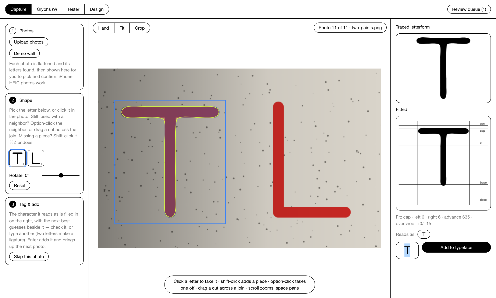

# Sanstyle

**Street-sourced typeface engine.** Photograph graffiti around town, drop
the photos in, confirm each letterform the machine finds, and it becomes a
glyph in a living, typeable, downloadable font — straightened, vectorized,
optically fitted, and auto-spaced, entirely in the browser.

Photo of a wall → usable `.ttf`.



## Run it

Fully client-side static app — no build step, no server, nothing leaves your
machine.

```bash
python3 -m http.server 8000     # or: npx serve .
# open http://localhost:8000
```

Opening `index.html` from disk works too. **Demo wall** generates a sprayed
letter so the whole flow can be tried without a photo. iPhone **HEIC/HEIF**
photos upload directly (Safari decodes natively; elsewhere a vendored libheif
decodes locally).

## How a letter gets in

Drop photos on the Capture tab (one or a hundred; iPhone HEIC works), share
them into the Drive inbox from your phone, or pick any photo from the Drive
gallery in the Glyphs tab. Each photo is analyzed in a background worker —
the page stays responsive while a stack of photos or a Drive re-scan is
worked through — and lands on the stage with every letter found in it laid
out beside it: one click picks the one you want.

**Reading the wall.** The photo is worked at 800 px on its long side, so a
photo from across the street and one from up close get the same treatment.
A wall lit unevenly — brighter where the sun falls, darker toward a corner —
is evened out first: a smooth light surface is fitted to the wall's own
color across the photo and taken out. Then the photo's colors are clustered
(`auto.inks`), and each cluster is judged by where and what it is:

- colors woven together — brick and its mortar, a wall in and out of
  shadow — are one surface's shades;
- a color that runs off the photo's edge and is not stroke-shaped (or fills
  its box, however many letters are cut out of it) is a *surface*: the
  wall, a panel, the sky;
- everything else is *paint*, and one paint's shades are merged — a
  stroke's dense core and its thin edge, silver's glint and shade — while
  its bleed halo (short of halfway from the wall to the paint) stays out.
  Each paint's pixels are judged against the surface right behind them (a
  white tag on a black panel against the panel, not the brick round it);
- a paint inside another's outline is the same letter (a throw-up's fill
  and its outline);
- every paint's shapes are scored on how much they look like a letter's
  strokes — long for their width, letter-sized, dense, neither a solid
  patch nor a sprawl off the frame — and the paints that look like letters
  go on. A paint that only hugs another (a halo, an outline, a 3D shadow)
  goes with it.

So the tag is found even when something else stands out more: dark pocks
on pale concrete, a sticker, a sign's print, the sky.

**Flattening.** A wall shot from the side or from below is foreshortened,
and every letter on it leans and tapers the same way. The photo's straight
lines are found (`js/rectify.js`: pixels of like gradient direction grown
into long thin regions), and the wall's lines — a rail, a panel's edge, a
curb, a sign's border — vote for vanishing points; the letters' own strokes
never do (they are masked out, and so is any line with a stroke's band of
paint on one side of it). When two or more wall lines agree, a homography
makes them parallel again and an affine map stands them square: the photo
comes out as if shot straight on. A correction that would warp the photo
wildly is refused. A leaning letter is then stood up by its own stems (see
**Upright**).

**Which letter, and what it says.** A photo of graffiti is rarely one clean
letter: the letter you shot touches its neighbors, a sticker, a sign, drips
and flakes of paint. Every shape found is read by a small neural network
that runs in the browser (`js/recognize.js`, weights in
`js/letters-model.js`): it was trained on ~800,000 handwritten characters and
glyphs from ~700 fonts (hand-lettering, marker and display faces among
them), all distorted to look like extracted graffiti — stroke weight, slant,
wobble, drips, ragged edges, specks — and on "junk": two or three letters
fused, a letter with a neighbor's fragment or a cut-off neighbor on it,
debris, scribbles, blobs, stickers. So it says both which character a shape
is (A–Z, a–z, 0–9, `! ? # @ & $ % * + = / \ < > ( ) [ ]`) and whether it is
one character at all. The letter finder (`js/letters.js`) then takes each
shape apart stroke by stroke (skeleton pieces that stop wherever they meet
another, or run into a junction) and grows groupings of them, keeping the
ones that read most clearly as a single character. A letter taken out of a
shape has to leave the rest explained — each piece of what is left reads as
a letter of its own, or is a crumb; a few crumbs adding up to a real part of
the shape must read as something together — and of two splits the one
whose rest reads better wins (taking the y out of "xy" leaves an x; an "O"
made of the y and the x's arch leaves the x in pieces). A shape that reads
plainly as one letter isn't taken apart at all. Every letter found is
ranked — it reads clearly as one character, it is big, it sits near the
middle of the photo, the frame didn't cut it off; a lone stroke that reads
only as an l, an i or a 1 goes behind the letters — and they are all laid
out in the Shape panel, the best selected, its character already typed.

**Click the letter you see.** Not the one you want? Click it in the photo.
The click is answered from the analysis in the worker: the shape under the
click (or the nearest within reach), and in it the letter that holds the
stroke you clicked, its neighbors fused on taken off. A thin marker tag the
analysis read only in bits is traced as a line from the stroke under the
click — pixels brighter (or darker) than what is round them and narrower
than a couple of percent of the photo, whatever their color, a fainter
stretch of the same stroke included — so a tag whose color wanders along
the stroke is one line to the program as it is to the eye; the wall's own
lines (a panel's edge running frame to frame) are left out. Where a
neighbor crossed the letter, the letter's stroke is drawn on through the
crossing at its own width, so a B's bowl stays smooth where an O ran
through it. Still fused? **Option-click** the neighbor: the stroke under the
click goes, with whatever hangs on the letter only through it (a fused
neighbor, a drip, a stray blob), and the faces where it came off are healed
and capped. Or **Option-drag** a short cut across the join and the region
regrows without it: the cut takes only from the far side of its line, so the
letter keeps every pixel up to the line.

**Trace the letter you see.** Drag along the letter's strokes on the photo,
the way it was painted — one drag a stroke, or the whole letter in one go —
and the paint under your lines is taken as the letter (`js/typed.js`). No
typeface or reading is involved, so any letterform at all comes out: a
tag's private R, a ligature, a mark that is no letter in any alphabet. Your
line only has to be near the stroke (a stroke's width or so off, more when
zoomed out); what you traced is the letter's skeleton:

- the paint under your line is read: the photo's paint that lies along it
  (a paint read as two — its light and its shade — taken together), and
  the colors of your line itself — those that make up much of what lies
  right under it, or lie there far more often than farther off, and the
  shades plainly nearer those than the wall's — so a stroke comes out
  whole whatever the photo's reading made of its paint (a silver taken for
  the wall, a dry brush's streaks, a paint full of the wall's pits); for a
  thin marker line, also the pixels that stand out from the wall as a
  line, so a faint stretch of it isn't lost;
- your line is moved onto the paint's center line, chosen for the whole
  line at once, so it holds on to the stroke you meant — through a stroke
  of the same paint that crosses it, never jumping over to a neighbor's;
- it is drawn at the paint's own width, out to the paint's own edge — a
  brush wider in one stroke than another, silver's shaded rim, a stroke
  running into a shadow, a marker's soft edge (a pixel is the stroke's
  when it is its paint and nearest its center line, or its color lies
  between the stroke's and the wall's right round it, nearer the
  stroke's), never into a neighbor's stroke or a third color that crosses
  it — and its edges evened out. Where another color
  crosses over it, the stroke is drawn on underneath at its width; a short
  gap where the stroke runs straight on is bridged; bare wall is never
  painted in;
- a stroke keeps its width: where it is suddenly narrower than just before
  and after it (a dry brush's thin start, paint streaked through with the
  wall), it is filled back out to that width on the side that looks like
  the stroke — streaked, or not the wall's colors — never the side that is
  plain wall; the paint's colors read off your line only fill what the
  photo's reading missed in the stroke, not wall of those colors beside it
  (a counter's gray by a silver stroke);
- where your stroke turns sharply (a W's middle, a V's point) or two of
  your strokes meet at an angle, the turn is round at the stroke's width,
  the way a brush turns; the edge never grows a spike or a sliver off it;
- a letter the photo's edge cuts off is carried on past the frame: a bowl
  by the curve that continues both its sides, a stroke straight on out,
  at its width — never capped at the edge;
- each end runs on along the paint a little (you needn't hit it exactly),
  but not on into a neighbor it touches; an end where the paint thins out
  to a point (a can or a marker lifting off, a brush's last streaks) is cut
  where the stroke is still near its own width and capped round, the way a
  pen tip ends a stroke — an end another of your strokes meets (or the
  same stroke, an O traced in one go) is a joint and is left as it is.

Each stroke you add reads the letter again with all of them (in the worker,
a fraction of a second); the character it reads as is filled in unless you
typed one. ⌘Z takes the last stroke off; Reset drops them all. The worker
keeps the analyses of the last few photos it used; a photo come back to
after a long queue was read is read again (in the background, as soon as
it is on the stage), so its strokes are always found in its paints.

A letter painted at a slant or sideways: turn the photo first — the
**Rotate** slider, or ↺ ↻ over the stage for a quarter turn — and trace it
as it stands; it comes out turned the same way.

**Type the letter you see.** Graffiti letters cross, overlap and run into
each other in the same paint, and no split into pieces can tell which
strokes are whose. You can: type the character you see (after clicking
near it, or with it framed in the middle of the photo) and the photo is
searched for that letter (`js/typed.js`), the way you see it:

- the character's skeleton — its strokes as center lines — comes from the
  character drawn in a few typefaces (sans, geometric, hands; both cases
  where they look alike on a wall, so a y can be a Y's shape);
- the skeleton is fitted onto the paint's own center lines: moved, scaled,
  stretched and slanted until its strokes lie along strokes of the paint
  running the same way — first loosely over the whole photo, then locked
  on point by point (iterative closest points), the paint's strokes left
  unexplained inside the letter counting against a placement;
- the best few placements (at every size) are each drawn and read by the
  recognizer, and the one that reads most as the character wins — a
  template sitting on part of a stroke can fit as well as the whole letter
  does, but it doesn't read as it;
- the letter is drawn stroke by stroke along the paint: along a stroke of
  its own, the paint's center line and width; across another letter's
  stroke, the stroke carried straight on through at its own width; across a
  short stretch where something hides it, bridged; a stem's or a leg's ends
  follow the paint to where it ends (legs to their feet, up into an apex).
  A stroke the painting doesn't have (an A drawn without its bar) is left
  out.

It runs in the background worker, on the photo's analysis, in a second or
two; the letter found goes first in the strip, and ⌘Z brings back what was
there. **Find “A” in the photo** in the Tag step runs it again.

**Crop.** The **Crop** button over the stage turns a drag into a crop box:
the photo is cut to it and read again — the letter gets the whole frame,
its paint judged against its own patch of wall, and a small letter is read
at more detail. ⌘Z brings the whole photo back as it was.

**Upright.** A leaning letter is stood up by its stems — a stroke followed
from end to end through its crossings, tall and near upright. Stems that
disagree (an A's legs) or none at all (an O, an S) leave the letter as it
is. The **Rotate** slider in the Shape panel turns it anywhere through 360°
(a letter painted sideways or upside down) — the photo on the stage turns
with it, so what you see is what goes in the font, and you can turn it
before you trace — and a rotation set by hand is kept for the rest of that
photo (a crop keeps it too). **Baseline** moves the letter up or down
against the baseline (a descender, a letter that sits high); height is set
later in Glyphs ("Optical nudges"), where both can be nudged again.
**Smoothing** evens out the letter's outline — a jagged edge, bumps and
notches go, the strokes keep their width (0 is the outline as found); like
the turn, it holds for every letter taken from the photo. **Reset** goes
back to the letters the automatic pass found — no crop, clicks, cuts,
pieces, traced strokes, turn or smoothing.

On the stage the selected letter is boxed and its trace drawn over the
paint — nothing else is laid over the photo (how to work on it is told in
the Shape panel; notes pop up in the corner); the clean silhouette and the
letterform fitted into the em sit beside it, upright. Check the character
(or type another), **Add** — the next photo comes up. A character is taken
from a photo once: add a second design of it from the same photo and you
are shown both and pick the one to keep (the other goes; Cancel changes
nothing). A photo leaves the queue only when its letterform was added or
skipped, and the queue waits across tabs and reloads of Drive photos. The
same photo shared into the inbox twice (same name, same size) is offered
once.

Stroke ends get a marker's round cap: nothing a pen draws is sharper than
its tip, so needle points thinner than the thin side of the tip are pruned
back to a cap, and a stroke that fades out (spray thinning, a marker
lifting) ends where it has its width back, with a disc of that width.
Anything *wider* than the stroke near its end (an arrowhead) is kept. The
clean-up that shaves fibers, burrs and drips never takes what holds the
letter together: a thin neck where an arm meets its stem, or a worn,
speckled stretch of a curl, stays. The tracer measures its corners and
smoothing against the stroke width: only inside corners, where two strokes
meet, are put back on their point.

**Seeing past what hides the letter.** A stroke that stops at bare wall has
ended: the pen lifted there. A stroke that stops at something else — a
drainpipe or a sign in front of it, a crack, a sticker, another color
painted over it, the edge of the photo — has only been hidden, and the
letter goes on underneath. Every pixel is read as wall, this paint, the
paint's own halo and shading, or hidden (anything else, and everything past
the frame, including the corners a flattened photo fills in). A stroke
end is cut short when the wall starts much further ahead of it than beside
it (a halo surrounds a stroke on every side alike; an occluder only sits in
front), and then:

- two cut-short ends that face each other across hidden ground are the same
  stroke, joined by the curve that continues both at their width — straight
  across a pipe, a circular arc round a U's bottom or an O's side past the
  frame — and never across visible wall; the pieces beyond join the letter;
- an end with no partner runs on into another piece of the letter if one
  lies straight ahead under the hidden ground (an N's stem hidden all the
  way down to its corner), or else carries on a plausible way — past the
  frame as far as the letter's other strokes reach that way, behind an
  occluder part way across it — and gets the pen's round cap;
- a stroke bitten along its side (a sticker over its edge, another color
  along it) gets its width back, measured from the edge that shows, onto
  hidden ground only;
- holes that show no wall (a sticker on the stroke, a chip) are filled, and
  a throw-up's outline — a band of another color hugging the whole letter —
  is part of it, counters and all.

A cut you draw is the one thing nothing is carried across.

**Ligatures and two-part characters.** Type two to four letters ("ar",
"bl", "gr") for a connected pair and it is captured as a ligature: the font
swaps it in whenever that sequence is typed (a GSUB `liga`/`rlig` lookup,
so it also fires in Illustrator, Figma, and browsers with tracking applied).
A character in pieces — the stem and point of a "!", an "i" and its dot —
is assembled by **shift-clicking** the other piece: only the new ink under
that click joins the shape, so a neighbor it touches stays out. The same
shift-click puts back a bit the extraction or a cut left out (where no paint
reads under the click at all — a glint, a worn patch — it brushes in a
stroke-width spot), and the pieces are remembered when the shape is rebuilt
by a cut or an undo. **⌘Z / Ctrl-Z** undoes the most recent cut, added or
removed piece, or crop.

## The optical fitting

Every glyph is fitted into a 1000-UPM em by its character class (caps and
figures to the 700-unit cap height; x-height, ascender and descender classes
for lowercase; a tuned table for marks), then corrected:

- **Overshoot compensation** — flat extremes (E, H, T) align exactly; round
  ones (O, S) overshoot ~11 units; pointed apexes (A, V) ~15, so everything
  *looks* the same height.
- **Auto sidebearings** — the whitespace depth of each side's margin profile
  sets the bearing (a simplified HT-Letterspacer): open shapes tuck in,
  solid stems get full clearance. Proportional spacing with zero manual
  metrics.

The compiler emits a complete TrueType font (cubic→quadratic, winding
normalization, all ten required tables, a GSUB ligature lookup when the
library has ligatures, correct checksums) and hot-swaps it into the page via
the FontFace API in a few milliseconds.

## The tester


- Types with the real compiled font. Newlines, paste, the lot.
- **Variant cycling** — when a character has several captured letterforms,
  repeated letters rotate through them (alternate fonts are compiled per
  variant slot), so doubles never twin. Toggleable.
- **Weight slider** — runs from the library's lightest captured letterform
  to its heaviest; every letter shows the variant nearest that weight, so
  the whole line thickens as you slide (letters with one variant keep it).
- **Where did that come from?** Hover any letterform and the bit of photo it
  was cut from pops up. The crop is kept on the device that captured it;
  anywhere else (another device, a browser that cleared its storage) it is
  cut again from the letterform's Drive photo — every letterform records
  which photo it came from and where in it, in `library.json` — and kept.
- **Pair kerning** — each pair of letters is spaced by its shapes
  (`metrics.kernPair`): the letters' side profiles are read at every
  height, and where their outermost points don't face each other (a T's
  bar over the y beside it, an A's foot under a V's arm, an L's leg under a
  T's bar) the pair is pulled in most of the way to where its nearest
  points would be as far apart as two facing strokes — never closer; a
  pair that would touch is moved apart. The variant each letter cycles to
  is kerned as drawn. It is in the tester, the exports and the TTF (a
  `kern` table); **Kern letter pairs** turns it off.
- **Manual kerning** — hit **Kern**, click a letterform, and arrow-key it
  (shift for coarse); it adds to the pair kerning. Esc returns to typing;
  kern tweaks carry into exports.
- Captured ligatures shape as one glyph while you type, in the tester and in
  every export.
- Background color, text color, and alignment controls; tracking down to
  −0.25 em; canvas aspect presets (Free / iPhone / Square / 16:9 / Poster)
  for mockups.
- **Exports**: the specimen as **SVG** (true vector paths), **PNG**, or
  **JPG** — plus the installable **TTF** itself.

## Getting the best results

- **Shoot the whole letter with some wall around it.** The wall's color is
  read from the photo's border; a letter that fills the frame edge to edge
  is finished past the edge, but only as well as the rest of it suggests.
- **Straight on beats the perfect angle.** A photo shot at an angle is
  flattened by its wall's own lines — a rail, a panel's edge, a curb — when
  two or more of them show; with none in the frame only the letter's own
  lean is corrected, so get a straight edge of the wall in shot when you
  can't shoot square on.
- **Fill the frame with the letter.** Photos are read at 800 px on their
  long side: a letter that is a small part of a wide shot comes out coarse
  (Crop brings it back up to detail).
- **Avoid hard shadows and glare across the letter.** A shadow reads as a
  different color and gets treated as something hiding the stroke.
- **Center the letter you want.** The letter nearest the middle of the
  frame, whole and big, is offered first; its neighbors come after it.
- **Sync as yourself.** Use the sign-in setup in [SETUP-SYNC.md](SETUP-SYNC.md)
  (an OAuth refresh token) rather than a service account, unless both
  folders live in a Shared Drive — otherwise Google refuses the writes.

The extraction is measured against synthetic walls with known ground truth
(`node tools/bench/run.mjs <tag>`: a drainpipe, a crack, stickers, an
overpainted letter, frame cutoffs, drips, a chrome throw-up, silver on
white, sharp valleys, fused same-color letters, fading marker ends), writing
an overlay per scene to `tools/bench/out/`, and against the photos in the
Drive inbox, each labeled with the character it shows.

The recognizer is rebuilt with `tools/recognizer/` (Python, PyTorch on the
CPU): `getfonts.py` and `fontcheck.py` fetch the fonts and check what each
covers, `gen.py` renders the distorted training set (EMNIST by-class from
Hugging Face + the fonts + junk), `train.py` trains the network and writes
`js/letters-model.js` (int8 weights, ~380 KB).

## Cloud sync (Google Drive + Vercel)

With the one-time setup in [SETUP-SYNC.md](SETUP-SYNC.md), the deployed site
becomes a passcode-gated, cross-device studio backed by two Drive folders:

- an **inbox folder** — share photos into it from your phone's Drive app (or
  upload through the site) and the site offers to extract letterforms from
  whatever is new since your last visit. The Glyphs tab shows every photo in
  the folder, used ones grayed with the count of letterforms each gave
  (hover one to see them); click any to bring it up on the stage at once,
  ahead of the queue, and extract from it again, or **Re-scan Drive
  photos** to queue them all;
- a **letterforms folder** — `library.json` (the full library: variants,
  fits, nudges, settings) plus an auto-maintained **SVG mirror** of every
  letterform, ready to open in Illustrator.

The browser only ever talks to the site's own `/api` routes (Vercel
serverless, in `api/`), which hold the Google credentials server-side and
check the passcode on every request. The site can act as your own Google
account (an OAuth refresh token, works with a personal Gmail) or as a
service account on a Shared Drive — Google no longer lets a service account
own files in a personal My Drive, and the red sync pill says so, with the
fix, when that is what's wrong. Without the env vars, the site runs
local-only exactly as before.

## Glyphs, sharing, design

The **Glyphs** tab holds the full character grid (plus a Ligatures row once
you have captured any): per-slot variants, activation, optical nudges (size,
baseline, sidebearings), delete. The
library persists locally and round-trips through **Export / Import JSON** so
sets can be shared and merged. The **Design** tab live-adjusts the interface
itself — text size, padding, gaps, control height, corner radius, line
weight, canvas padding — persisted per browser.

## Under the hood

```
api/
  _lib.js        Google auth (your account via OAuth, or a service-account
                 JWT) + Drive REST helpers (no SDK)
  health/library/inbox/photo/upload/diag — the sync endpoints
tools/
  get_refresh_token.mjs   one-time Google sign-in for the site
  validate_font.py        fontTools round-trip used by the tests
  bench/                  extraction bench: synthetic walls with ground truth
  recognizer/             training data + training for the letter recognizer
js/
  geometry.js    vectors, RDP, point-in-poly, homography, Bézier math
  fitcurves.js   Schneider least-squares cubic fitting
  raster.js      Otsu, color match, morphology, components, fill-holes,
                 occlusion bridge
  trace.js       mask → boundary loops → corner-aware Bézier contours
  fitting.js     char classes, overshoot, auto-spacing, variant sets,
                 ligature keys, weight targeting
  ttf.js         dependency-free TrueType compiler (+ GSUB ligatures)
  classify.js    template character matching
  recognize.js   the letter recognizer: a small conv net, run in plain JS
  letters-model.js  its trained weights (generated by tools/recognizer)
  letters.js     letters in a fused shape, stroke by stroke; upright lean
  typed.js       a letter typed, found: its skeleton fitted onto the
                 paint's and drawn through the strokes that cross it;
                 a letter traced: your strokes snapped onto the paint
  rectify.js     flattening: wall lines → vanishing points → homography
  auto.js        the paints on the wall, letter finding, clicks answered
                 from the analysis
  worker.js      runs the analysis and clicks off the page's thread
  extract.js     click-to-trace, clean-up, stroke graph, stroke chains
  complete.js    occlusion: hidden stroke ends, joins, frame completion,
                 bitten strokes, outlines
  heic.js        HEIC/HEIF intake (vendored libheif, lazy-loaded)
  export.js      specimen layout → SVG / PNG / JPG, per-letterform SVGs
  store.js       library model, persistence, import/export
  sync.js        passcode gate, Drive pull/merge/push, inbox prompts
  demo.js        procedural demo walls (seeded)
  ui/            capture stage (the review surface), review queue, glyph
                 grid + Drive gallery, tester
```

Zero runtime dependencies (the HEIC decoder is vendored and loads only when
a HEIC arrives). The same files run headless in Node for tests.

## Tests

```bash
npm test        # 82 unit tests: geometry, tracing, fitting, morphology,
                # deskew, seeded extraction, stroke-graph isolation,
                # occlusion completion (hidden ends, joins across occluders
                # and past the frame, bitten strokes, outlines), stroke
                # chains splitting fused letters, the recognizer (input
                # grid, clean letters), the letter finder, lean, one-sided
                # cuts, necks that hold, no spikes at stroke ends, a halo
                # kept out of its paint and a gray bar read apart, a stroke kept through a
                # crossing at its own width, the letter's own wall,
                # inbox de-duplication, where a letterform lies in its
                # photo, a wall lit unevenly, the wall's
                # tolerance with letters running off the frame,
                # classifier scoring, ligature keys + GSUB, weight targeting,
                # TTF byte format, and the api routes (JWT signing verified
                # against a real keypair, Drive calls stubbed)
npm run e2e     # headless Chromium: demo walls + HEIC intake on the stage,
                # the review queue, click-to-trace, cuts, shift-click pieces,
                # the letter strip, a click that hands back the letter alone,
                # a typed A found in "HAH" through the H's bars (and ⌘Z),
                # the same A traced by hand, stroke by stroke (⌘Z, Reset,
                # a dropped analysis read again, traced on a turned photo,
                # a second A from the same photo: pick which to keep,
                # Smoothing, a bowl carried on past the photo's edge),
                # Baseline,
                # Option-click removal, crop + its undo, Reset, a letter
                # behind a pipe, one cut off by the frame, a throw-up's
                # outline, variant cycling, ligature shaping, weight
                # slider, source popup, kerning, exports, TTF download
                # (fontTools-validated) — plus the full sync flow (gate,
                # inbox extraction, SVG mirroring, wiped-device restore,
                # site→Drive upload, the Drive gallery — a clicked photo
                # ahead of the queue, the letterforms each photo gave — +
                # re-scan, a letterform's photo cut again on a device that
                # never had it) against an in-memory mock of the api contract
```

## Roadmap

- Live community wall (shared backend + moderation; the JSON export is
  already the wire format).
- OpenType `calt`/`rand` so variant cycling ships inside the font file, not
  just the tester.
- Stroke-weight normalization across captures.
